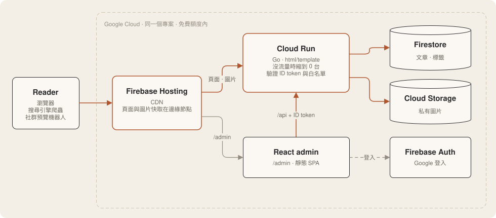

# cindle

個人部落格與知識庫。

## 特色

- **零成本運行。** Cloud Run 沒有流量時縮到 0 台，大部分請求由 CDN 直接回應，
  用量落在免費額度內；預算警示與最多 3 台的上限，避免意外產生費用。
- **對搜尋引擎友善。** 公開頁面由伺服器產生完整 HTML，並附上結構化資料，
  搜尋引擎爬蟲與社群連結預覽不需要執行 JavaScript。
- **快速。** 頁面與圖片快取在 CDN 邊緣節點；Cloud Run 從 0 台啟動時，
  Go 程式不到一秒就能開始服務。
- **安全。** 後台 API 只開放白名單帳號；圖片存放在私有 bucket，經由程式提供；
  整個專案不使用任何服務帳號金鑰。

仍在開發中。基礎設施用 Terraform 管理，放在 [`infrastruct_as_code/`](infrastruct_as_code/)；
進度與設計文件在 [`docs/`](docs/PLAN.md)。

架構圖是 draw.io 檔，可以直接用 [draw.io](https://app.diagrams.net) 開啟
`docs/architecture.drawio.svg` 編輯。
